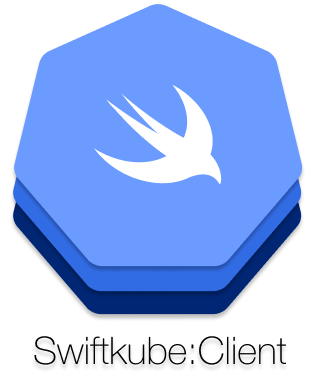

<p align="center">
	
</p>

<p align="center">
	
	<a href="https://v1-18.docs.kubernetes.io/docs/reference/generated/kubernetes-api/v1.18/">
		
	</a>
	<a href="https://swift.org/package-manager">
		
	</a>
	
	<a href="https://github.com/swiftkube/client/actions">
		
	</a>
</p>

## Table of contents

* [Overview](#overview)
* [Compatibility Matrix](#compatibility-matrix)
* [Examples](#examples)
* [Usage](#usage)
  * [Creating a client](#creating-a-client)
  * [Configuring a client](#configuring-the-client)
  * [Client authentication](#client-authentication)
  * [Client DSL](#client-dsl)
* [Advance usage](#advanced-usage)
* [Metrics](#metrics)
* [Installation](#installation)
* [License](#license)

## Overview

Swift client for talking to a [Kubernetes](http://kubernetes.io/) cluster via a fluent DSL based on [SwiftNIO](https://github.com/apple/swift-nio) and the [AysncHTTPClient](https://github.com/swift-server/async-http-client).

- [x] Covers all Kubernetes API Groups in v1.18.9
- [x] Automatic configuration discovery
- [x] DSL style API
  - [x] Highest API version for the most common API Groups
  - [ ] Cover all API Groups/Versions
- [x] Generic client support
- [x] Swift-Logging support
- [x] Loading resources from external sources
  - [x] from files
  - [x] from URLs
- [x] Read Options
- [x] List Options
- [x] Delete Options
- [ ] PATCH API
- [ ] `/scale` API
- [ ] `/status` API
- [ ] Better resource watch support
- [ ] Better CRD support
- [ ] Controller/Informer support
- [x] Swift Metrics
- [ ] Complete documentation
- [ ] End-to-end tests

## Compatibility Matrix

|                           | K8s <1.18.9 | K8s 1.18.9 - 1.18.13 |
|---------------------------|-------------|----------------------|
| SwiftkubeClient 0.4.x     | -           | ✓                    |

- `✓` Exact match of API objects in both client and the Kubernetes version.
- `-` API objects mismatches either due to the removal of old API or the addition of new API. However, everything the client and Kubernetes have in common will work.

## Examples

Concrete examples for using the `Swiftkube` tooling reside in the [Swiftkube:Examples](https://github.com/swiftkube/examples) repository.

## Usage

### Creating a client

To create a client just import `SwiftkubeClient` and init an instance.

 ```swift
 import SwiftkubeClient
 
 let client = try KubernetesClient()
 
 // when finished
 try client.syncShutdown()
 ```

You should shut down the `KubernetesClient` instance, which in turn shuts down the underlying `HTTPClient`. Thus you shouldn't call `client.syncShutdown()` before all requests have finished:


### Configuring the client

The client tries to resolve a `kube config` automatically from different sources in the following order:

- Kube config file in the user's `$HOME/.kube/config` directory 
- `ServiceAccount` token located at `/var/run/secrets/kubernetes.io/serviceaccount/token` and a mounted CA certificate, if it's running in Kubernetes.

Alternatively it can be configured manually, for example:

```swift
let caCert = try NIOSSLCertificate.fromPEMFile(caFile)
let authentication = KubernetesClientAuthentication.basicAuth(
    username: "admin", 
    password: "admin"
)

let config = KubernetesClientConfig(
    masterURL: "https://kubernetesmaster",
    namespace: "default",
    authentication: authentication,
    trustRoots: NIOSSLTrustRoots.certificates(caCert),
    insecureSkipTLSVerify: false
)

let client = KubernetesClient(config: config)
```

### Client authentication

The following authentication schemes are supported:

- Basic Auth: `.basicAuth(username: String, password: String)`
- Bearer Token: `.bearer(token: String)`
- Client certificate: `.x509(clientCertificate: NIOSSLCertificate, clientKey: NIOSSLPrivateKey)`

### Client DSL

`SwiftkubeClient` defines convenience API to work with Kubernetes resources. Using this DSL is the same for all resources.

> The examples use the blocking `wait()` for brevity. API calls return `EventLoopFutures` that can be composed and acted upon in an asynchronous way.

> Currently only a subset of all API groups are accessible via the DSL. See [Advanced usage](#advanced-usage) for mor details.
  
#### List resources 

```swift
let namespaces = try client.namespaces.list().wait()
let deployments = try client.appsV1.deployments.list(in: .allNamespaces).wait()
let roles = try client.rbacV1.roles.list(in: .namespace("ns")).wait()
```

You can filter the listed resources or limit the returned list size via the `ListOptions`:

```swift
let deployments = try client.appsV1.deployments.list(in: .allNamespaces, options: [
	.labelSelector(.eq(["app": "nginx"])),
	.labelSelector(.notIn(["env": ["dev", "staging"]])),
	.labelSelector(.exists(["app", "env"])),
	.fieldSelector(.eq(["status.phase": "Running"])),
	.resourceVersion("9001"),
	.limit(20),
	.timeoutSeconds(10)
]).wait()
```

#### Get a resource 

```swift
let namespace = try client.namespaces.get(name: "ns").wait()
let deployment = try client.appsV1.deployments.get(in: .namespace("ns"), name: "nginx").wait()
let roles = try client.rbacV1.roles.get(in: .namespace("ns"), name: "role").wait()
```

You can also provide the following `ReadOptions`:

```swift
let deployments = try client.appsV1.deployments.get(in: .allNamespaces, options: [
	.pretty(true),
	.exact(false),
	.export(true)
]).wait()
```

#### Delete a resource

```swift
try.client.namespaces.delete(name: "ns").wait()
try client.appsV1.deployments.delete(in: .namespace("ns"), name: "nginx").wait()
try client.rbacV1.roles.delete(in: .namespace("ns"), name: "role").wait()
```

You can pass an instance of `meta.v1.DeleteOptions` to control the behaviour of the delete operation:

```swift
let deletOptions = meta.v1.DeleteOptions(
	gracePeriodSeconds: 10,
	propagationPolicy: "Foreground"
)
try client.pods.delete(in: .namespace("ns"), name: "nginx", options: deleteOptions).wait()
```

#### Create and update a resource

Resources can be created/updated directly or via the convenience builders defined in [SwiftkubeModel](https://github.com/swiftkube/model)

```swift
// Create a resouce instance and post it
let configMap = core.v1.ConfigMap(
	metadata: meta.v1.Metadata(name: "test"),
	data: ["foo": "bar"]
}
try cm = try client.configMaps.create(inNamespace: .default, configMap).wait()


// Or inline via a builder
let pod = try client.pods.create(inNamespace: .default) {
        sk.pod {
            $0.metadata = sk.metadata(name: "nginx")
            $0.spec = sk.podSpec {
                $0.containers = [
                    sk.container(name: "nginx") {
                        $0.image = "nginx"
                    }
                ]
            }
        }
    }
    .wait()
```

#### Watch a resource

> :warning: Watching a resource opens a persistent connection until the client is closed.

```swift
let task: HTTPClient.Task<Void> = client.pods.watch(in: .namespace("default")) { (event, pod) in
    print("\(event): \(pod)")
}

// The task can be cancelled later to stop watching
task.cancel()
```

#### Follow logs

> :warning: Following a pod logs opens a persistent connection until the client is closed.

```swift
let task: HTTPClient.Task<Void> = client.pods.follow(in: .namespace("default"), name: "nginx") { (line) in
    print(line)
}

// The task can be cancelled later o stop following
task.cancel()
```

## Advanced usage

### Loading from external sources

A resource can be loaded from a file or a URL:

```swift
// Load from URL, e.g. a file
let url = URL(fileURLWithPath: "/path/to/manifest.yaml")
let deployment = try apps.v1.Deployment.load(contentsOf: url)
```

### API groups

To access API groups not defined as a DSL, e.g. `rbac.v1beta1` a dedicated client can still be intantiated. A client can be either `namespace scoped` or `cluster scoped`:

```swift
try client.namespaceScoped(for: rbac.v1beta1.RoleBinding.self).list(in: .allNamespaces).wait()
try client.clusterScoped(for: rbac.v1beta1.ClusterRole.self).list().wait()
```

### Type-erased usage

Often when working with Kubernetes the concrete type of the resource is not known or not relevant, e.g. when creating resources from a YAML manifest file. Other times the type or kind of the resource must be derived at runtime given its string representation.

Leveraging `SwiftkubeModel`'s type-erased resource implementations `AnyKubernetesAPIResource` and its corresponding List-Type `AnyKubernetesAPIResourceList` it is possible to have a generic client instance, which must be initialized with a `GroupVersionKind` type:

```swift
guard let gvk = try? GroupVersionKind(for: "deployment") else {
   // handle this
}

// Get by name
let resource: AnyKubernetesAPIResource = try client.for(gvk: gvk)
    .get(in: .default , name: "nginx")
    .wait()

// List all
let resources: AnyKubernetesAPIResourceList = try client.for(gvk: gvk)
    .list(in: .allNamespaces)
    .wait()
```

#### GroupVersionKind

A `GroupVersionKind` can be initialized from:

- `KubernetesAPIResource` instance
- `KubernetesAPIResource` type
- Full API Group string
- Lowecassed singular resource kind
- Lowercased plural resource name
- lowecased short resource name

```swift
let deployment = ..
let gvk = GroupVersionKind(of: deployment)
let gvk = GroupVersionKind(of: apps.v1.Deployment.self)
let gvk = GroupVersionKind(rawValue: "apps/v1/Deployment")
let gvk = GroupVersionKind(for: "deployment")
let gvk = GroupVersionKind(for: "deployments")
let gvk = GroupVersionKind(for: "deploy")
```

## Metrics

`KubernetesClient` uses [SwiftMetrics](https://github.com/apple/swift-metrics) to collect metric information about the requests count and latencies.

The following metrics are gathered:

- `sk_http_requests_total(counter)`: the total count of the requests made by the client.
- `sk_http_request_errors_total(counter)`: the total number of requests made, that returned a http error.
- `sk_request_errors_total(counter)`: the total number of requests that couldn't be dispatched due to non-http errors.
- `sk_http_request_duration_seconds(timer)`: the complete request durations.


### Collecting the metrics

To collect the metrics you have to bootstrap a metrics backend in your application. For example you can collect the metrics to prometheus via `SwiftPrometheus`:

```swift
import Metrics
import Prometheus

let prom = PrometheusClient()
MetricsSystem.bootstrap(prom)
```

and expose a `/metrics` endpoint for scraping:

```swift
// if using vapor
app.get("metrics") { request -> EventLoopFuture<String> in
    let promise = request.eventLoop.makePromise(of: String.self)
    try MetricsSystem.prometheus().collect(into: promise)
    return promise.futureResult
}
```

## Installation

To use the `SwiftkubeModel` in a SwiftPM project, add the following line to the dependencies in your `Package.swift` file:

```swift
.package(name: "SwiftkubeClient", url: "https://github.com/swiftkube/client.git", from: "0.5.0"),
```

then include it as a dependency in your target:

```swift
import PackageDescription

let package = Package(
    // ...
    dependencies: [
        .package(name: "SwiftkubeClient", url: "https://github.com/swiftkube/client.git", from: "0.5.0")
    ],
    targets: [
        .target(name: "<your-target>", dependencies: [
            .product(name: "SwiftkubeClient", package: "SwiftkubeClient"),
        ])
    ]
)
```

Then run `swift build`.

## License

Swiftkube project is licensed under version 2.0 of the [Apache License](https://www.apache.org/licenses/LICENSE-2.0). See [LICENSE](./LICENSE) for more details.
